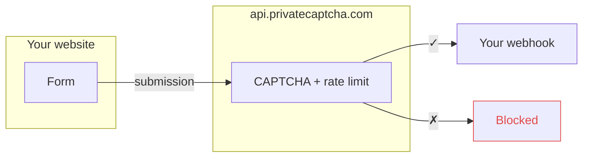

Form proxy allows you to use our endpoint (e.g. `https://api.privatecaptcha.com/form/123`) instead of your endpoint for `<form>` request. We will forward ("proxy") only submissions when captcha and rate-limiting have passed.



This allows to **secure** your endpoint:
- we check if captcha was solved (this assumes you will use Private Captcha widget on the form)
- your actual form URL is hidden (security-by-obscurity) and noone knows about it
- we apply rate-limiting and other protection [rules]() to the form endpoint and captcha

This makes it for a perfect use-case for forms on static websites or general webhooks protection (e.g. forms backed by Google Docs, Webflow or Zapier / Make / N8N).

## Captcha property

Each form proxy has to be used with a captcha property (the point of "form proxy" is that we check captcha solution for you).

When you create a new form, a new corresponding [property]() is created. This property can be managed from the Form settings, but it cannot be moved or deleted independent of the form. You can configure various [difficulty rules]() for the captcha property and they will be taken into account when performing Form security check prior to forwarding the submission.

## Settings

We'll go through all form settings that you can change.


### URL

This is where the actual form submissions will be forwarded after the captcha verification and other security (e.g. rate limiting) applied.

### Method

You can select one of the standard HTTP methods: `POST` (default), `PUT`, `DELETE` and `PATCH`. All forms use `POST` by default for forwarding requests.

### Requests per minute

You can limit how many requests can be forwarded to your destination each minute (default is `10`). Submissions exceeding this limit will be rejected with `429` (Too Many Requests). Each configuration includes "burst" which is set to `RPM + 10`.

### Retry

You can optionally configure requests to be retried when the endpoint returns `5xx` HTTP error code or network connection problems occurred. Retries are attempted after a delay.

## Integration

You can integrate this with a number of form backend services:

- [FormInit](https://forminit.com/) (formerly Getform)
- [Formspree](https://formspree.io/) - general backend
- [FormSubmit](https://formsubmit.co/) - email forwarding
- [FormSpark](https://www.formspark.io/) - email forwarding
- [Basin](https://usebasin.com/)
- [StaticForms](https://www.staticforms.dev/)

And any other automation software like [N8N](https://n8n.io/) or [Make](https://www.make.com/).

### Setup

{}

### Create form in the provider

In the provider of your choice create a new form. Note the form URL they give you.

In N8N/Make it will be the [webhook](https://docs.n8n.io/integrations/builtin/core-nodes/n8n-nodes-base.webhook/) URL.

### Create Form Proxy

In Private Captcha portal create a new Form Proxy. Use that provider's URL in the [URL](#url) field.

### Use proxy URL in your form

In your actual website, use something like:

```html
<form action="https://api.privatecaptcha.com/form/<long-id>"
      method="POST">
	<!--- the rest --->
</form>
```

You will get an exact snippet you need to use after you've created the form.

{}

## Limits

### Billing

Forms limits are tied to property limits. Each form submission requires a valid captcha puzzle (and a solution). So number of forms is limited by the number of properties in your account and number of submissions is limited to the number of requests included for your properties.

### Technical

The only accepted inbound form type is `application/x-www-form-urlencoded` (`multipart/form-data` or _any_ other forms are not accepted).

Form size is currently limited to `1 MB` max and will likely be reduced in future.

The only HTTP method available for inbound requests is `POST`.

Redirects are treated as errors.

### Deactivation

Form will be deactivated in case of multiple sequential failures. You will receive an email notification in such case.

Form is _not_ immediately deactivated in case of requests limits violation (e.g. traffic spike). However, you will be contacted by support.

## Privacy

Form submissions are not persisted in **any** storage, not logged, and are available on our servers only in transit. You have an option to sign the [DPA](https://privatecaptcha.com/legal/dpa).