# DNS Proxy
It is possible to make captcha widget to fetch puzzles and, later, verify solutions against your domain or subdomain instead of `api.privatecaptcha.com` by using a "CNAME proxy".

## Basic idea

For loading captcha widget, end-user _never_ contacts `*.privatecaptcha.com` domains.

```mermaid
sequenceDiagram
    participant User as End User
    participant Web as Customer Website
    participant CNAME as captcha.customer.com<br/>(CNAME Record)
    participant API as api.privatecaptcha.com

    Note over User,API: Captcha Display Flow
    User->>Web: Visit website
    Web->>CNAME: Load captcha widget
    Note over CNAME: DNS resolves to<br/>api.privatecaptcha.com
    CNAME->>API: Request forwarded
    API-->>User: Captcha displayed<br/>(appears from customer.com)
    
    Note over User,API: ✓ User only sees customer.com domain

```



You can also verify puzzle solutions against the same configured domain, but, on the backend, this has little value.

## Step-by-step setup

{}

### Add a new DNS record

With your DNS provider, setup a CNAME record for the chosen domain/subdomain to point to `api.privatecaptcha.com` (also possible to choose [EU isolation]() endpoint `api.eu.privatecaptcha.com`).

Example with CloudFlare:


### Setup DNS proxy in Portal

> [!NOTE]
> "DNS Proxy" functionality requires to have an add-on purchased via the `Billing` settings.

Go to the [Private Captcha Portal](https://portal.) and navigate to `Settings -> DNS Proxy`. Enter you domain and select the same endpoint (Global/EU) that you added in the previous step with your DNS provider.


### Update widget snippet

The last step is to update the widget to fetch puzzles via your domain. To achieve that you need to set [`data-puzzle-endpoint` attribute]().

```diff {filename="index.html"}
@@ -32,7 +32,7 @@
    <div class="private-captcha"
+       data-puzzle-endpoint="https://privatecaptcha.mydomain.com/puzzle" 
        data-sitekey="xyz">
    </div>
```

{}

## Testing

> [!NOTE]
> DNS changes (on both sides!) can take up to 24 hours to propagate.

You test this locally using a [test puzzle]():

```bash
curl -H "Origin: not-empty" https://yourdomain.com/puzzle\?sitekey\=aaaaaaaabbbbccccddddeeeeeeeeeeee
```

when this works, you can try opening the webpage where you have the widget.
