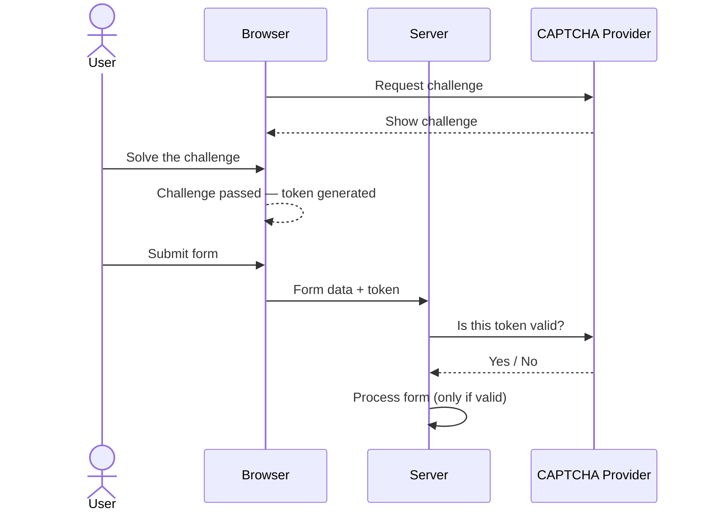

# How CAPTCHA works
Implementing a CAPTCHA is a standard security practice to prevent automated bots from abusing your forms (e.g., for spam, brute-force attacks, or fake registrations).

{}

### Frontend

You add two things to your HTML page: **a widget** (the visual challenge the user interacts with) and **a script** loaded from the CAPTCHA provider. The script drives the widget and handles all communication with the provider's servers.

When the user completes the challenge, the provider's script injects a hidden input field into your form containing a short-lived token. The user never sees this field — it travels silently alongside the rest of the form data when the form is submitted.

[Read more]()

### Backend

On the server, **before** you do anything with the submission, you take that token and send it to the CAPTCHA provider's verification API. The provider confirms whether the token is valid and was genuinely earned by a human. Only if verification passes do you proceed to process the form — save the data, send the email, create the account, etc. If it fails, you reject the submission outright.

{}


  
  

